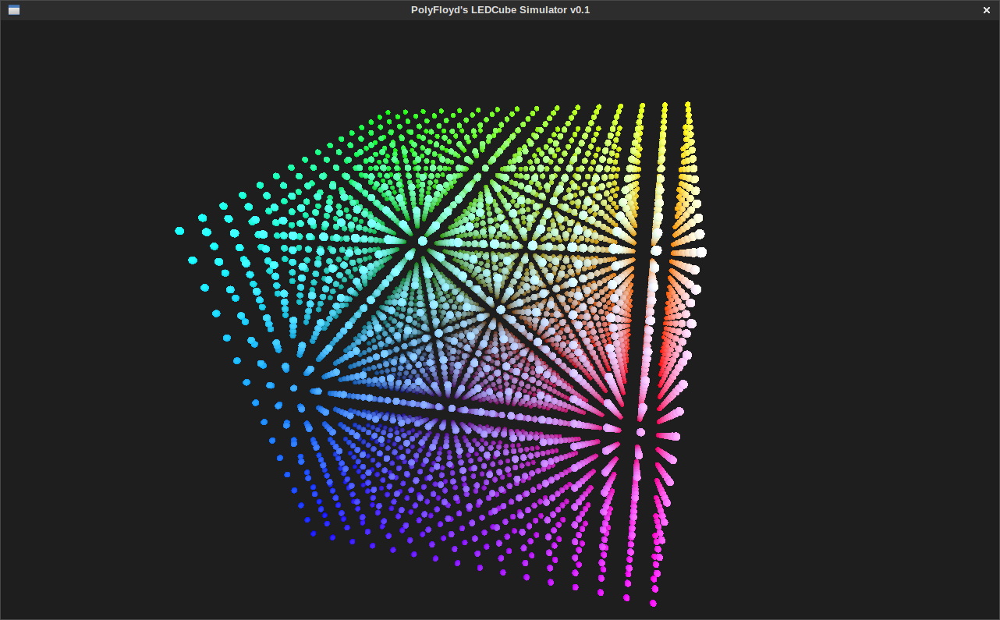

Volumetric Display Simulator
============================

Ledcubesim is a simulator I made for creating and testing programs for my
16x16x16 RGB 3D-LEDCube project from 2014 which is surprisingly never finished.
It was later re-purposed to simulate a generic volumetric display.



## Building
Make sure you have [Go](http://golang.org/dl), GLFW3 and GLEW installed.
On Debian (and maybe Ubuntu) systems, you can install all dependencies as follows:
```
sudo apt-get install git golang libgflw3-dev libglew-dev
```
Then to install ledcubesim:
```
go get -u github.com/polyfloyd/ledcubesim
```

## Usage
```
Usage of ledcubesim:
  -c int
      Set all dimensions to the same size
  -cx int
      The width of the cube (default 16)
  -cy int
      The length of the cube (default 16)
  -cz int
      The height of the cube (default 16)
```

* Moving the mouse while holding the left mousebutton will cause the view to rotate.
* Scrolling with the mouse adjust the zoom.
* Pressing R on the keyboard will reset the view to its initial condition.
* Pressing S on the keyboard will toggle the visibility of black (off) voxels.

## Input
Write `width * height * length * 3` bytes to stdin. Colors are encoded as
`RGB`.
